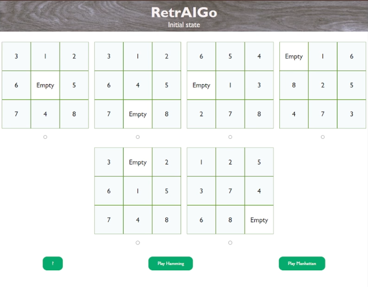
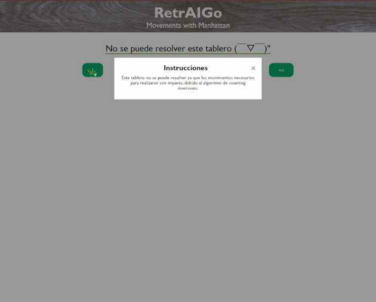
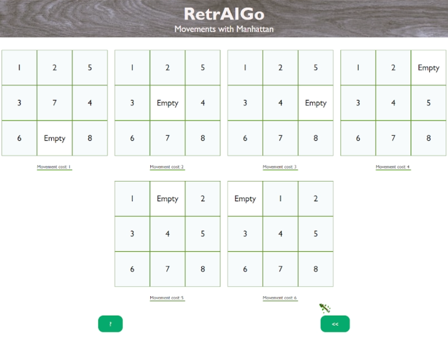
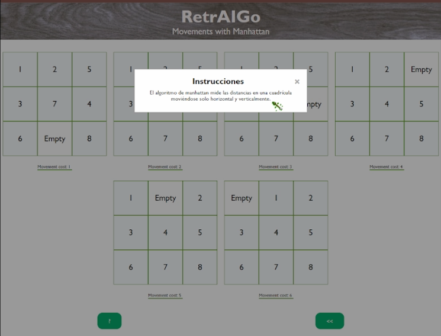
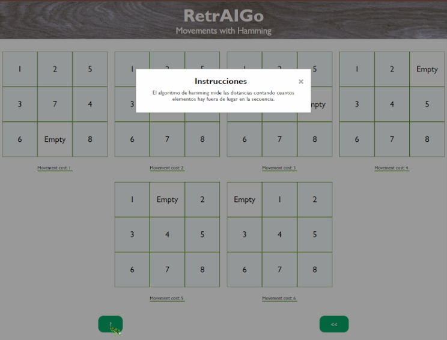

## RetroAIGo - UNA- 2024

This project is an 8-piece puzzle game. It has 6 initial states, and each one will try to reach the final state: [empty, 1, 2], [3, 4, 5], [6, 7, 8]. To achieve this, the Manhattan and Hamming algorithms were used. The webpage was created using Express, written in JavaScript, while the game logic and algorithms were implemented in Prolog. 

<details>
  <summary>Website screenshots</summary>
  
  
  
  
  
  
</details>

## Members:
Nicole Araya Ballestero | Esteban Mojica Gonzalez | Daniel Ramirez Calvo | Ariana Solano Vallejos 

## Instalation

Enter on the project folder and run:

```
npm i
```
or
```
yarn add
```

## Execution

To execute the website, run:

```
npm start
```

And to execute the prolog RetroAIGo server, in other prompt, run:

```
swipl
[http_server].
```
